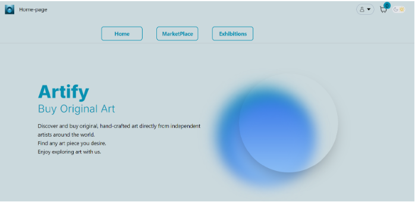
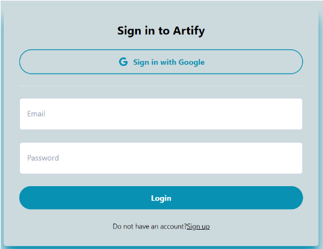
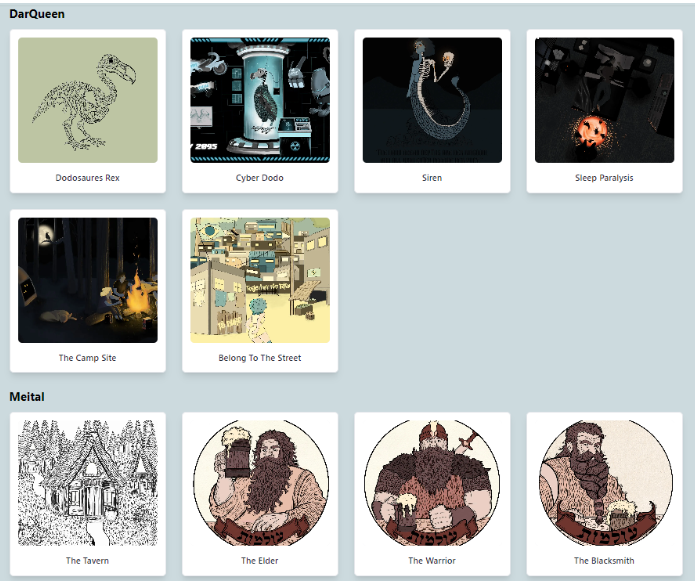
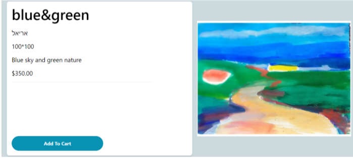
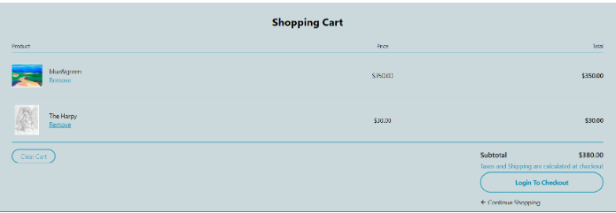
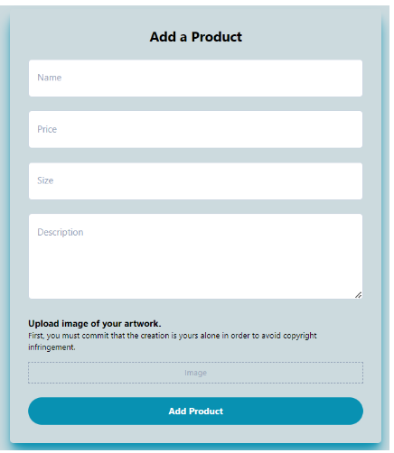
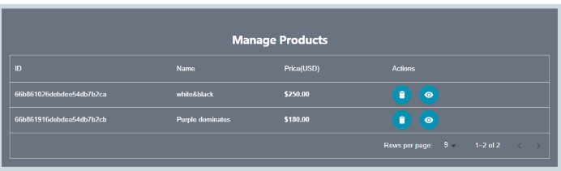

# Artify – Online Art Exhibition Platform

Artify is a full-stack web application designed for showcasing, browsing, and purchasing artworks in a virtual gallery environment. The platform delivers a smooth and secure experience for both artists and buyers, combining modern UI with robust backend services.

## Features

- User authentication with email or Google login
- Virtual exhibitions sorted by artist
- Marketplace with filterable artwork listings
- Detailed product pages with add-to-cart functionality
- Secure checkout using Stripe
- Dark/Light mode toggle
- Order history and profile management
- Admin dashboard for managing artworks

## Tech Stack

**Frontend:**  
React, Tailwind CSS, React Router

**Backend:**  
Node.js, Express

**Database & Services:**  
MongoDB, Firebase (image storage), Stripe API, OAuth

**Tools:**  
Git, GitHub, VS Code

## User Overview

### 1. Browsing Artworks

**Homepage**  
Main landing page showcasing all available artworks in a clean, responsive gallery view.  

### User Authentication  
Users can sign in using email or Google, or register as new users.  

**Exhibition View**  
Virtual exhibitions categorized by artist, allowing users to explore by creator.  

**Product Page**  
Detailed information about each artwork, including title, artist, price, and size, with an option to add to cart.  

### 2. Purchase Flow

**Cart Overview**  
Displays selected artworks, allows item removal and shows total price.  

**Payment Page**  
Secure payment form powered by Stripe, with field validation and real-time summary.  

### 3. Artwork Management (Admin)

**Add Product Page**  
Upload new artworks with details such as title, category, size, price, and image.  

**Manage Products**  
Edit or delete existing artworks and update availability.  

